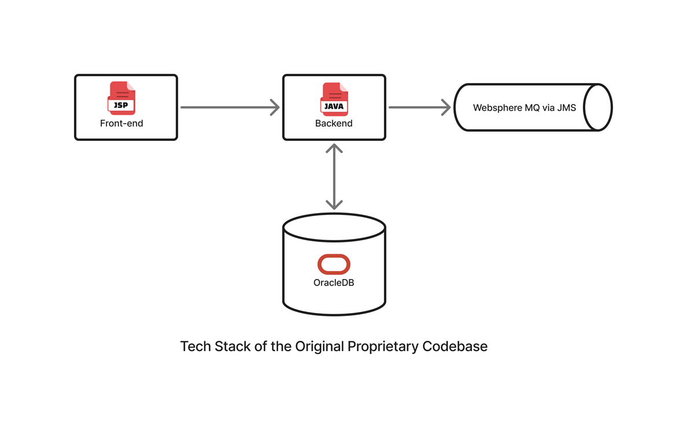
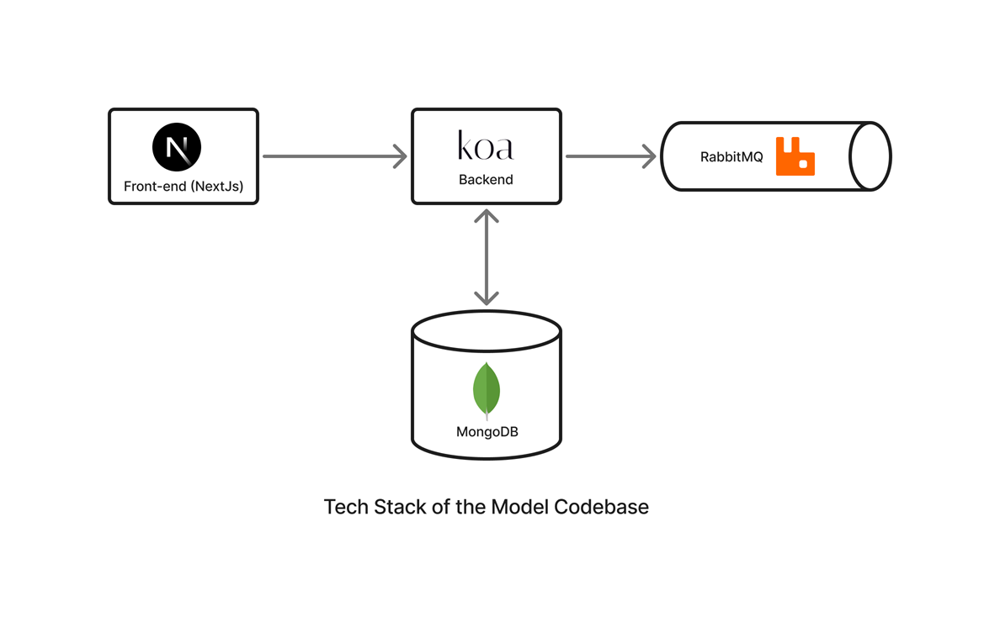
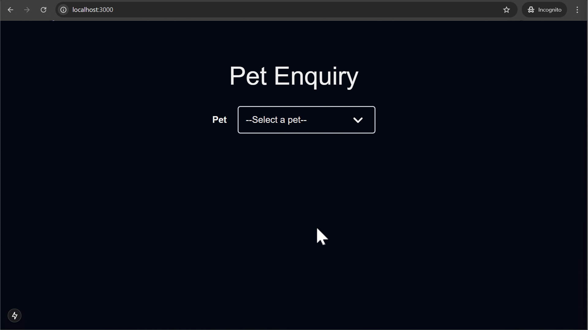

# Before & After: A Compact Look at My Refactoring Work

I modeled one of my refactoring work to showcase my understanding of code maintenance and improvement. The original codebase is proprietary and cannot be shared, but this model captures the essence of the work I did.

## Differences in Technology Stack

The Original Codebase was built using JSP, Java, Oracle DB, WebLogic, and WebSphere.



This model is built using Next.js, React, Koa, MongoDB, RabbitMQ, and Docker.



The choice of tools in the model is based on what I was experimenting with at the time. It showcases my ability to apply the lessons from one tech stack to another, but the real goal here is to demonstrate the refactoring process itself.

## Application Overview

The original application had a set of request types we could select on the UI. Each request type had a different set of fields. I have modeled this as a pet enquiry system where the user can select a pet type (dog, fish, etc.), like so:



Filling out the form and submitting it would send a request to the server, which would then send an XML to an external system via a queue and return an acknowledgement number to the user. I have modeled this like so:


## How I Picked the Functionality to Refactor

Supporting a new request type was a common requirement in almost every release. We spent around a week to do this. However, I noticed a new request type was not much different from the existing ones. It was just a different set of fields on the UI and tags in the outgoing XML with the same structure. I picked this functionality to refactor because it had high generality in behavior and low generality in implementation. It was also a recurring task.

## Sample Requirement

The requirement would usually contain the following information. In this example, we're supporting a new pet type: Hamster.

### Request Type Information

| New Request Type | UI Label | UI Possible Values | Backend Criteria Key | Backend Criteria Value |
| ---------------- | -------- | ------------------ | -------------------- | ---------------------- |
| **Hamster**      | Hamster  | NA                 | pet                  | hamster                |

### Attributes Information

| Attribute       | UI Label       | UI Possible Values | Backend Criteria Key  | Backend Criteria Value |
| --------------- | -------------- | ------------------ | --------------------- | ---------------------- |
| color           | Color          | Black              | hamsterColor          | BLACK006               |
|                 |                | Brown              |                       | BROWN007               |
|                 |                | White              |                       | WHITE008               |
|                 |                | Mixed              |                       | MIXED009               |
| wheel necessity | Needs a wheel? | Boolean Yes/No     | hamsterNeedsWheel     | true/false             |
| companionship   | Lives alone?   | Boolean Yes/No     | hamsterNeedsToBeAlone | true/false             |

## The Problem: Hardcoded Values & Unnecessary Branching

The [bad-code branch][6] models the codebase state before my refactoring. We performed the following changes to support a new request type in this state. These changes are applied to the [bad-code-with-hamster branch][5] on this repo for demonstration purpose.

1. Create a new request type in the database. This will show hamster as a new option in the UI.

```js
db.petsConfigurationBad.insertOne({ label: "Hamster", value: "hamster" });
```

2. Find the closest existing Form, duplicate it, and modify it based on the new requirement as `frontend/src/components/HamsterForm/`. [view diff][1]

3. Add a branch for `HamsterForm` in `frontend\src\app\[pet]\page.tsx`. [view diff][2]

4. Find the closest existing xml template file, duplicate it and modify it based on the new requirement as `backend\src\petEnquiry\xml\hamster.xml`. [view diff][3]

5. Add a branch for hamster in `backend\src\petEnquiry\processor.js`. [view diff][4]

We needed these many steps because there were hardcoded values throughout the codebase. For example, we had a separate XML template with placeholder values for each request type (see [here][10]). We processed the XML template as a string, replacing the placeholder values differently for each request type (see [here][11]). This made it difficult to support a new request type; we had to duplicate code and add branches.

This model is a simplified version, so it doesn't show the true complexity of the original codebase which had a lot of branching and hardcoded values, not just a handful like in this example.

## The Solution: Dynamic Form Generation Using DB Configuration

The solution I designed and implemented was to use database configuration to dynamically generate the form and generate the XML with XSLT.

With this approach, we need only a single step to support a new request type, hamster, in this example:

```js
db.petsConfigurationGood.insertOne({
  label: "Hamster",
  value: "hamster",
  attributes: [
    {
      label: "Color",
      valueName: "hamsterColor",
      type: "options",
      options: [
        { label: "Black", value: "BLACK006" },
        { label: "Brown", value: "BROWN007" },
        { label: "White", value: "WHITE008" },
        { label: "Mixed", value: "MIXED009" },
      ],
    },
    {
      label: "Needs a wheel?",
      valueName: "hamsterNeedsWheel",
      type: "boolean",
    },
    {
      label: "Lives alone?",
      valueName: "hamsterNeedsToBeAlone",
      type: "boolean",
    },
  ],
});
```

All the information needed to generate the form and XML is now in the database and we need not touch any code to support a new request type. This version of the demo is in the [main branch][7] of this repo.

## The Crux of the Solution

This is made possible by two big ideas. In the frontend, the PetForm component is generic and generates the form based on the `attributes` key above (see [here][8]). It knows what to render for a given attribute type. If we introduce a new attribute type, then we would need some code to support it but the existing attribute types are reusable without code changes. Even for new attribute types, we would need to add code only the first time because it would be reusable! This is a big win.

The second big idea is to use [XSLT][9] to generate the XML in the backend. The JSON generated from the form submission is converted to XML using XSLT (see [here][12]). The JSON keys reflect the XML tags we need because they are generated from the database configuration. The XSLT is generic and doesn't care about the request type. It just takes the JSON and generates the XML based on the XSLT template. This is another big win.

## Running the app locally (for development)

**Pre-requisites:**

- Docker installed and running on your machine. (Tested with version 25.0.3)
- Node.js installed on your machine. (Tested with version 20.9.0)

**Steps to run the app locally:**

- Clone the repo
- Run `docker-compose up` in the root directory of the repo. This will start the MongoDB and RabbitMQ containers.
- Open a new terminal, navigate to `backend` and run `npm install` to install the backend dependencies.
- Run `npm start` in the `backend` directory to start the backend server. This will start the Koa server and listen on port 4000.
- Open another terminal, navigate to `frontend` and run `npm install` to install the frontend dependencies.
- Run `npm run dev` in the `frontend` directory to start the frontend server.
- Open your browser and navigate to `http://localhost:3000/` to see the app in action.

[1]: https://github.com/andrewnessinjim/refactor-demo-xml/commit/98214662d373898e6067790166f02811ca295ad1
[2]: https://github.com/andrewnessinjim/refactor-demo-xml/commit/faefa5bc2bd0a406c6f38d571cd0a5c50166fe37
[3]: https://github.com/andrewnessinjim/refactor-demo-xml/commit/024e727c1aae91435ab538a8ab03765aba12c28d
[4]: https://github.com/andrewnessinjim/refactor-demo-xml/commit/8605788c80edfdd88168726b4ab251652e6b8c96
[5]: https://github.com/andrewnessinjim/refactor-demo-xml/commits/bad-code-with-hamster/
[6]: https://github.com/andrewnessinjim/refactor-demo-xml/tree/bad-code
[7]: https://github.com/andrewnessinjim/refactor-demo-xml/tree/main
[8]: https://github.com/andrewnessinjim/refactor-demo-xml/blob/main/frontend/src/components/PetForm/PetForm.tsx#L97-L104
[9]: https://github.com/andrewnessinjim/refactor-demo-xml/blob/main/backend/src/petEnquiry/xsl/petSearchRequest.xsl
[10]: https://github.com/andrewnessinjim/refactor-demo-xml/tree/bad-code/backend/src/petEnquiry/xml
[11]: https://github.com/andrewnessinjim/refactor-demo-xml/blob/bad-code/backend/src/petEnquiry/processor.js#L15-L41
[12]: https://github.com/andrewnessinjim/refactor-demo-xml/blob/main/backend/src/petEnquiry/processor.js#L14-L27
